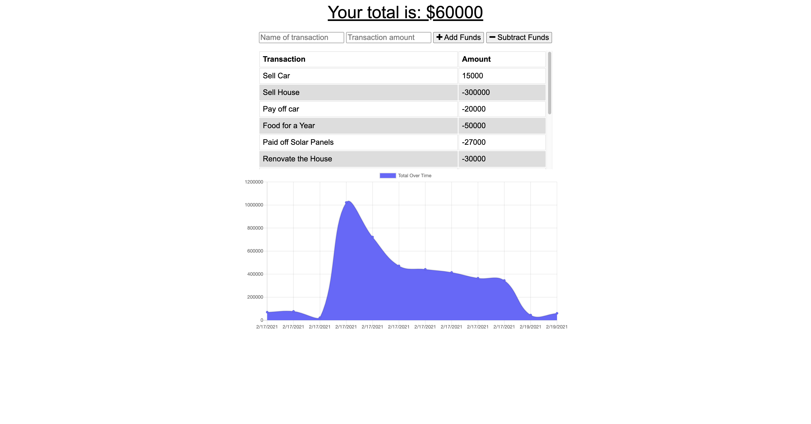

# Progressive Budget

> User can use this web application to keep track of spending and income.

### Table of Contents

- [Description](#description)
- [Installation](#installation)
- [Technologies](#technologies)
- [How To Use](#how-to-use)
- [Links](#links)
- [Author Info](#author-info)

---

## Description
Using this web app, the user can keep track of spendatures on or offline. If the user is off line, her or inputs will be saved in the indexedDB, once the user is back online indexedDB is empted and the data is stored in the database. 

---

## Installation
No Requirements.

---
[Back To The Top](#read-me-template)

## Technologies
HTML, CSS, JavaScript, Node.js, express, IndexedDB.

[Back To The Top](#read-me-template)

---

## How To Use
Simply type in an income or spending venture, and click the corresponding  add or subract buttom. Transactions and your current total will be displayed on the page.
   
   [Back To The Top](#read-me-template)
   
---

## Links

Link to site:
https://morning-lowlands-85346.herokuapp.com/

Link to GitHub repository:
https://github.com/deleonfrancis/Progressive_Budget

[Back To The Top](#read-me-template)

---

## Author Info

- E-mail: dxfrancis.coding@gmail.com

[Back To The Top](#read-me-template)

---

## License

MIT
Copyright (c) 2021 Deleon Francis

Permission is hereby granted, free of charge, to any person obtaining a copy
of this software and associated documentation files (the "Software"), to deal
in the Software without restriction, including without limitation the rights
to use, copy, modify, merge, publish, distribute, sublicense, and/or sell
copies of the Software, and to permit persons to whom the Software is
furnished to do so, subject to the following conditions:

The above copyright notice and this permission notice shall be included in all
copies or substantial portions of the Software.

THE SOFTWARE IS PROVIDED "AS IS", WITHOUT WARRANTY OF ANY KIND, EXPRESS OR
IMPLIED, INCLUDING BUT NOT LIMITED TO THE WARRANTIES OF MERCHANTABILITY,
FITNESS FOR A PARTICULAR PURPOSE AND NONINFRINGEMENT. IN NO EVENT SHALL THE
AUTHORS OR COPYRIGHT HOLDERS BE LIABLE FOR ANY CLAIM, DAMAGES OR OTHER
LIABILITY, WHETHER IN AN ACTION OF CONTRACT, TORT OR OTHERWISE, ARISING FROM,
OUT OF OR IN CONNECTION WITH THE SOFTWARE OR THE USE OR OTHER DEALINGS IN THE
SOFTWARE.
